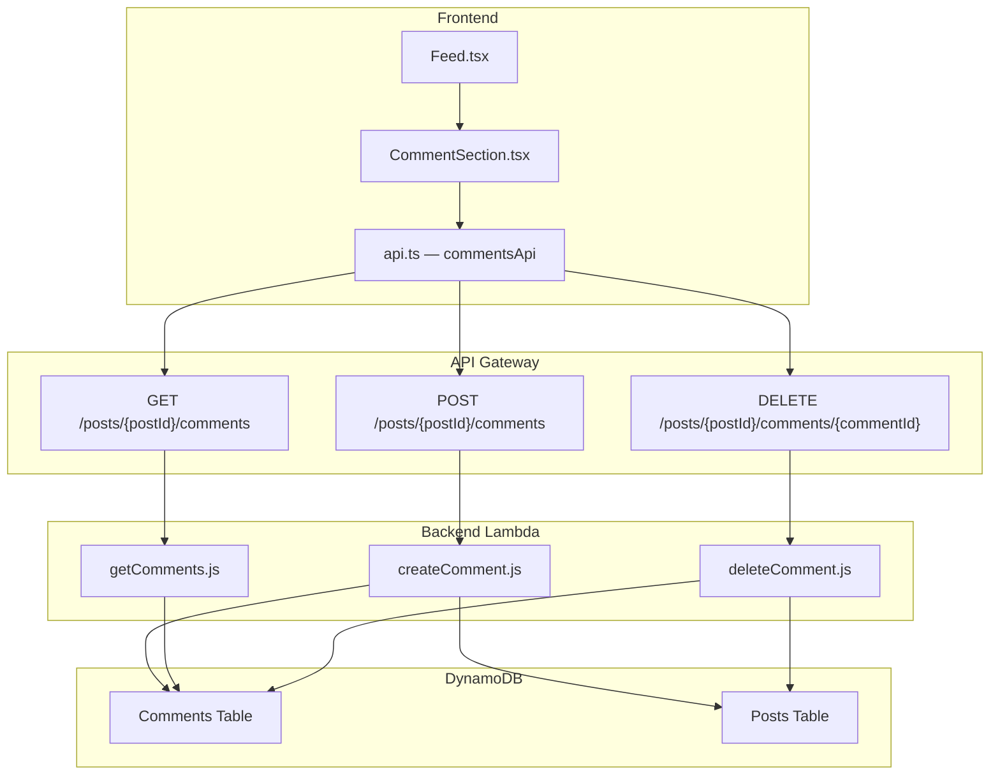
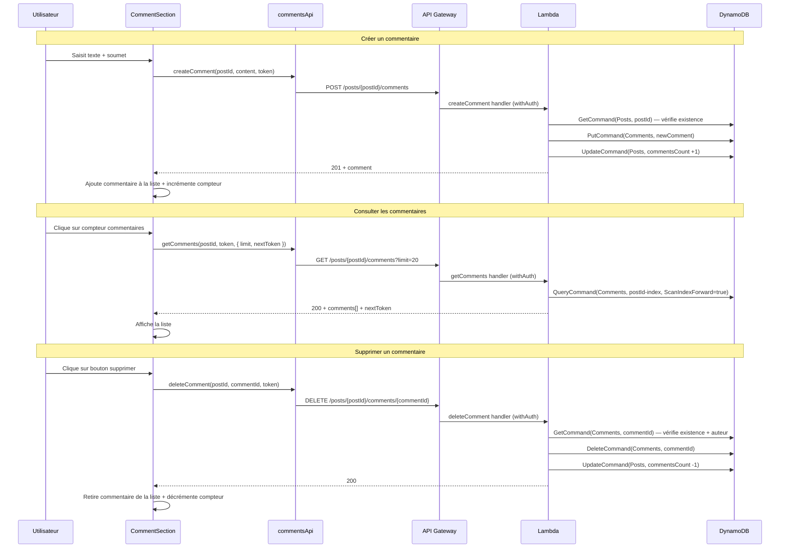

# Document de conception — Commentaires sur les publications

## Vue d'ensemble

Cette fonctionnalité ajoute un système de commentaires aux publications du micro-blog. Elle permet aux utilisateurs authentifiés de créer, consulter et supprimer des commentaires directement depuis le fil d'actualité, sans rechargement de page. L'architecture suit les conventions existantes : trois fonctions Lambda (création, consultation, suppression), intégrées via API Gateway, utilisant la table DynamoDB `Comments` déjà provisionnée, et un composant React `CommentSection` intégré dans les cartes de publication du Feed.

## Architecture



### Flux de données



## Composants et interfaces

### Backend — Fonctions Lambda

#### 1. `createComment.js` — `POST /posts/{postId}/comments`

- Protégé par `withAuth`
- Reçoit `{ content }` dans le body
- Valide : contenu non vide, ≤ 280 caractères, publication existante
- Crée l'enregistrement dans la table Comments
- Incrémente `commentsCount` sur la publication (UpdateCommand atomique)
- Retourne 201 avec le commentaire créé

#### 2. `getComments.js` — `GET /posts/{postId}/comments`

- Protégé par `withAuth`
- Query sur le GSI `postId-index` avec `ScanIndexForward: true` (tri chronologique ascendant)
- Pagination : `limit` (défaut 20), `nextToken` encodé en URL
- Enrichit chaque commentaire avec le `displayName` de l'auteur via la table Users
- Retourne 200 avec `{ comments, nextToken }`

#### 3. `deleteComment.js` — `DELETE /posts/{postId}/comments/{commentId}`

- Protégé par `withAuth`
- Vérifie que le commentaire existe et que `userId` correspond à l'utilisateur authentifié
- Supprime l'enregistrement de la table Comments
- Décrémente `commentsCount` sur la publication (UpdateCommand atomique, minimum 0)
- Retourne 200

### Frontend — Composants React

#### 1. `CommentSection.tsx`

Composant affiché sous une carte de publication quand l'utilisateur clique sur le compteur de commentaires.

**Props :**
```typescript
interface CommentSectionProps {
  postId: string;
  commentsCount: number;
  onCommentsCountChange: (delta: number) => void;
}
```

**Responsabilités :**
- Charge les commentaires au montage (appel `getComments`)
- Affiche la liste des commentaires avec nom d'auteur (lien vers profil), contenu, date formatée
- Affiche un champ de saisie + bouton pour soumettre un nouveau commentaire
- Gère la pagination (bouton « Charger plus » si `nextToken` existe)
- Affiche un bouton de suppression sur les commentaires de l'utilisateur courant
- Appelle `onCommentsCountChange(+1)` ou `onCommentsCountChange(-1)` pour synchroniser le compteur dans le Feed

#### 2. Modifications de `Feed.tsx`

- Ajoute un état `expandedComments: Set<string>` pour suivre quelles publications ont leur section commentaires ouverte
- Rend le compteur de commentaires cliquable (toggle de la section)
- Intègre `<CommentSection>` sous chaque carte de publication quand elle est dans `expandedComments`

### Couche API — `services/api.ts`

Ajout d'un objet `commentsApi` suivant le pattern existant :

```typescript
export const commentsApi = {
  getComments: async (
    postId: string,
    token: string,
    options?: { limit?: number; nextToken?: string }
  ): Promise<{ comments: Comment[]; nextToken: string | null }> => { ... },

  createComment: async (
    postId: string,
    content: string,
    token: string
  ): Promise<{ comment: Comment }> => { ... },

  deleteComment: async (
    postId: string,
    commentId: string,
    token: string
  ): Promise<void> => { ... },
};
```

### Infrastructure — `app-stack.ts`

Ajout de trois fonctions Lambda (`CreateCommentFunction`, `GetCommentsFunction`, `DeleteCommentFunction`) avec :
- Variables d'environnement : `COMMENTS_TABLE`, `POSTS_TABLE`, `USERS_TABLE`
- Permissions DynamoDB : read/write sur Comments et Posts, read sur Users
- Routes API Gateway sous la ressource `{postId}` existante :
  - `comments` → GET (getComments), POST (createComment)
  - `comments/{commentId}` → DELETE (deleteComment)

### Internationalisation

Ajout des clés de traduction dans `translations.ts` :

| Clé | EN | FR |
|-----|----|----|
| `comments.placeholder` | Write a comment... | Écrire un commentaire... |
| `comments.submit` | Comment | Commenter |
| `comments.submitting` | Posting... | Publication... |
| `comments.delete` | Delete | Supprimer |
| `comments.deleteConfirm` | Delete this comment? | Supprimer ce commentaire ? |
| `comments.loadMore` | Load more comments | Charger plus de commentaires |
| `comments.empty` | No comments yet. Be the first! | Aucun commentaire. Soyez le premier ! |
| `comments.error` | Failed to load comments. | Impossible de charger les commentaires. |
| `comments.createError` | Failed to post comment. | Impossible de publier le commentaire. |
| `comments.deleteError` | Failed to delete comment. | Impossible de supprimer le commentaire. |
| `comments.tooLong` | Comment cannot exceed 280 characters | Le commentaire ne peut pas dépasser 280 caractères |
| `comments.emptyContent` | Comment cannot be empty | Le commentaire ne peut pas être vide |

## Modèles de données

### Type `Comment` (frontend)

```typescript
// frontend/src/types/comment.ts
export interface Comment {
  id: string;
  postId: string;
  userId: string;
  content: string;
  createdAt: string;
  user?: {
    id: string;
    displayName: string;
  };
}
```

### Enregistrement DynamoDB — Table Comments

| Attribut    | Type   | Description                          |
|-------------|--------|--------------------------------------|
| `id`        | S (PK) | UUID v4 du commentaire               |
| `postId`    | S      | ID de la publication associée        |
| `userId`    | S      | ID de l'auteur du commentaire        |
| `content`   | S      | Texte du commentaire (1–280 chars)   |
| `createdAt` | S      | Horodatage ISO 8601                  |

**GSI `postId-index`** : PK = `postId`, SK = `createdAt` — permet la requête paginée triée chronologiquement.

### Mise à jour de la table Posts

L'attribut `commentsCount` (déjà présent dans le type `Post`) est incrémenté/décrémenté atomiquement via `UpdateCommand` avec l'expression :
```
SET commentsCount = if_not_exists(commentsCount, :zero) + :delta
```
Avec une condition pour ne pas descendre en dessous de 0 lors de la décrémentation.


## Propriétés de correction

*Une propriété est une caractéristique ou un comportement qui doit rester vrai pour toutes les exécutions valides d'un système — essentiellement, une déclaration formelle de ce que le système doit faire. Les propriétés servent de pont entre les spécifications lisibles par l'humain et les garanties de correction vérifiables par la machine.*

### Propriété 1 : Complétude des données d'un commentaire

*Pour tout* contenu valide (non vide, non composé uniquement d'espaces, ≤ 280 caractères) et toute publication existante, le commentaire retourné par l'API (à la création ou à la consultation) doit contenir les champs : `id`, `postId`, `userId`, `content`, `createdAt`, et le `displayName` de l'auteur lors de la consultation.

**Valide : Exigences 1.1, 2.4**

### Propriété 2 : Rejet des contenus invalides

*Pour toute* chaîne de caractères qui est vide, composée uniquement d'espaces, ou dont la longueur dépasse 280 caractères, la tentative de création d'un commentaire doit être rejetée avec un code HTTP 400, et la liste des commentaires de la publication doit rester inchangée.

**Valide : Exigences 1.3, 1.4**

### Propriété 3 : Tri chronologique des commentaires

*Pour tout* ensemble de commentaires associés à une publication, la liste retournée par l'API de consultation doit être triée par date de création (`createdAt`) en ordre ascendant (du plus ancien au plus récent).

**Valide : Exigence 2.1**

### Propriété 4 : Correction de la pagination

*Pour toute* publication ayant N commentaires (N > 20), la première page retournée doit contenir au plus 20 éléments et un `nextToken` non nul. L'union de toutes les pages successives doit contenir exactement les N commentaires, sans doublons et sans omissions.

**Valide : Exigence 2.2**

### Propriété 5 : Cohérence du compteur de commentaires

*Pour toute* publication, après une séquence de C créations et S suppressions de commentaires, la valeur de `commentsCount` de la publication doit être égale à C − S (avec un minimum de 0).

**Valide : Exigences 1.2, 3.2**

### Propriété 6 : Autorisation de suppression basée sur l'auteur

*Pour tout* commentaire et tout utilisateur authentifié, la suppression du commentaire doit réussir si et seulement si l'utilisateur est l'auteur du commentaire. Un non-auteur doit recevoir un code HTTP 403.

**Valide : Exigences 3.1, 3.3**

### Propriété 7 : Complétude du rendu d'un commentaire

*Pour tout* commentaire affiché dans l'interface, le rendu doit contenir le nom d'affichage de l'auteur (sous forme de lien vers `/profile/{userId}`), le contenu textuel du commentaire, et la date de création formatée.

**Valide : Exigence 4.5**

### Propriété 8 : Visibilité du bouton de suppression selon l'auteur

*Pour tout* commentaire affiché dans l'interface et tout utilisateur courant, le bouton de suppression doit être visible si et seulement si l'utilisateur courant est l'auteur du commentaire.

**Valide : Exigence 4.7**

## Gestion des erreurs

### Backend

| Scénario | Code HTTP | Message |
|----------|-----------|---------|
| Body manquant ou JSON invalide | 400 | `Missing request body` |
| Contenu vide ou espaces uniquement | 400 | `Comment content cannot be empty` |
| Contenu > 280 caractères | 400 | `Comment content cannot exceed 280 characters` |
| Publication inexistante (création) | 404 | `Post not found` |
| Commentaire inexistant (suppression) | 404 | `Comment not found` |
| Suppression par un non-auteur | 403 | `You are not authorized to delete this comment` |
| Token manquant ou invalide | 401 | `Missing authorization token` / `Authentication failed` |
| Erreur interne DynamoDB | 500 | `Error creating/getting/deleting comment` |

Toutes les réponses d'erreur suivent le format JSON existant avec les en-têtes CORS standards.

### Frontend

- Les erreurs réseau et API sont capturées dans des blocs try/catch
- Les messages d'erreur sont affichés dans l'interface via des éléments `.error-message` traduits (clés `comments.error`, `comments.createError`, `comments.deleteError`)
- Le champ de saisie conserve le texte en cas d'échec de soumission pour éviter la perte de données
- Les états de chargement (`loading`) désactivent le bouton de soumission pour éviter les doubles envois

## Stratégie de tests

### Approche duale

La stratégie combine des tests unitaires (exemples spécifiques) et des tests basés sur les propriétés (vérification universelle) pour une couverture complète.

### Tests basés sur les propriétés (PBT)

**Bibliothèque** : `fast-check` (TypeScript/JavaScript)

Chaque propriété du document de conception sera implémentée comme un test basé sur les propriétés avec un minimum de 100 itérations. Les tests utiliseront des mocks pour DynamoDB afin de rester rapides et sans dépendance externe.

**Configuration** :
```typescript
fc.assert(
  fc.property(arbitraire, (input) => {
    // vérification de la propriété
  }),
  { numRuns: 100 }
);
```

**Tag de chaque test** : `Feature: post-comments, Property {N}: {titre}`

**Propriétés à implémenter** :
1. Complétude des données d'un commentaire (Propriété 1)
2. Rejet des contenus invalides (Propriété 2)
3. Tri chronologique des commentaires (Propriété 3)
4. Correction de la pagination (Propriété 4)
5. Cohérence du compteur de commentaires (Propriété 5)
6. Autorisation de suppression basée sur l'auteur (Propriété 6)
7. Complétude du rendu d'un commentaire (Propriété 7)
8. Visibilité du bouton de suppression selon l'auteur (Propriété 8)

### Tests unitaires (exemples)

- Création d'un commentaire sur une publication inexistante → 404 (Exigence 1.5)
- Consultation des commentaires d'une publication sans commentaires → liste vide, 200 (Exigence 2.3)
- Suppression d'un commentaire inexistant → 404 (Exigence 3.4)
- Toggle de la section commentaires au clic sur le compteur (Exigence 4.1)
- Présence du champ de saisie et du bouton de soumission (Exigence 4.2)
- Soumission et mise à jour de la liste sans rechargement (Exigence 4.3)
- Mise à jour du compteur affiché après création (Exigence 4.4)
- Bouton « Charger plus » avec pagination (Exigence 4.6)
- Suppression et mise à jour du compteur au clic (Exigence 4.8)
- Affichage des libellés en EN et FR (Exigence 5.1)

### Tests d'intégration / smoke

- Vérification que les trois endpoints sont accessibles via API Gateway (Exigences 6.1, 6.2, 6.3)
- Vérification que les endpoints rejettent les requêtes sans authentification (Exigence 6.4)
- Vérification des en-têtes CORS dans les réponses (Exigence 6.5)
