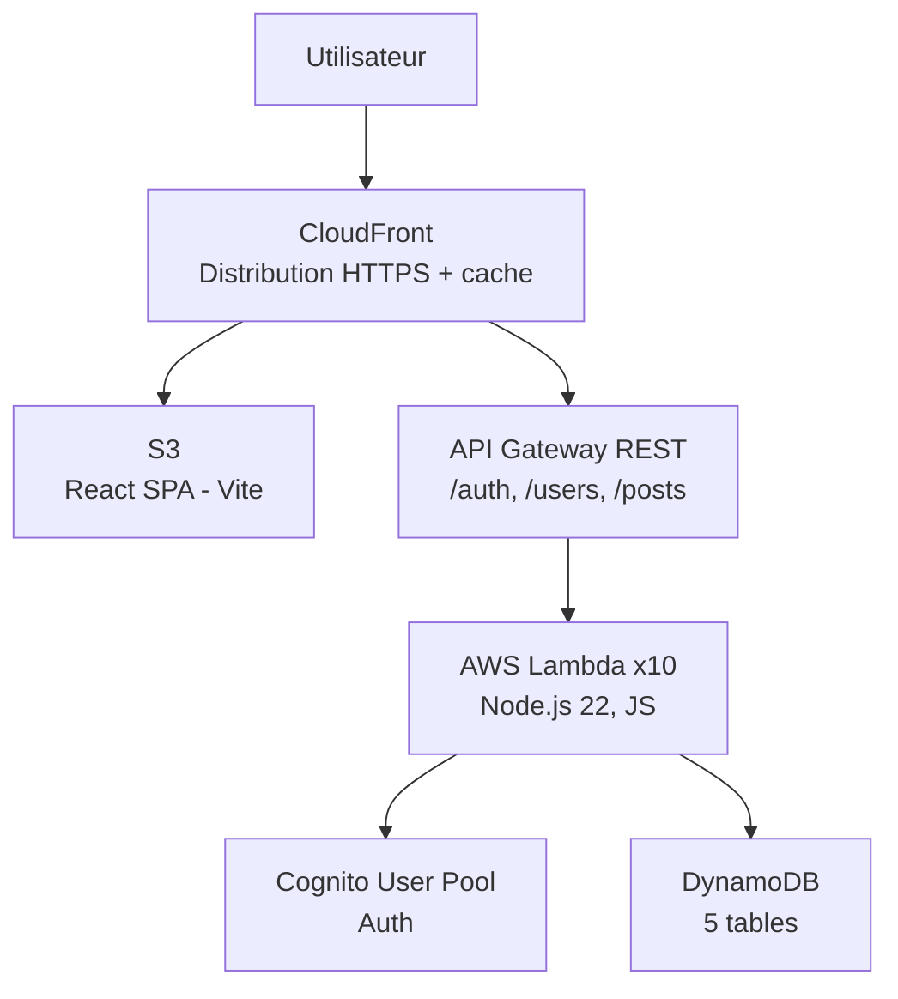
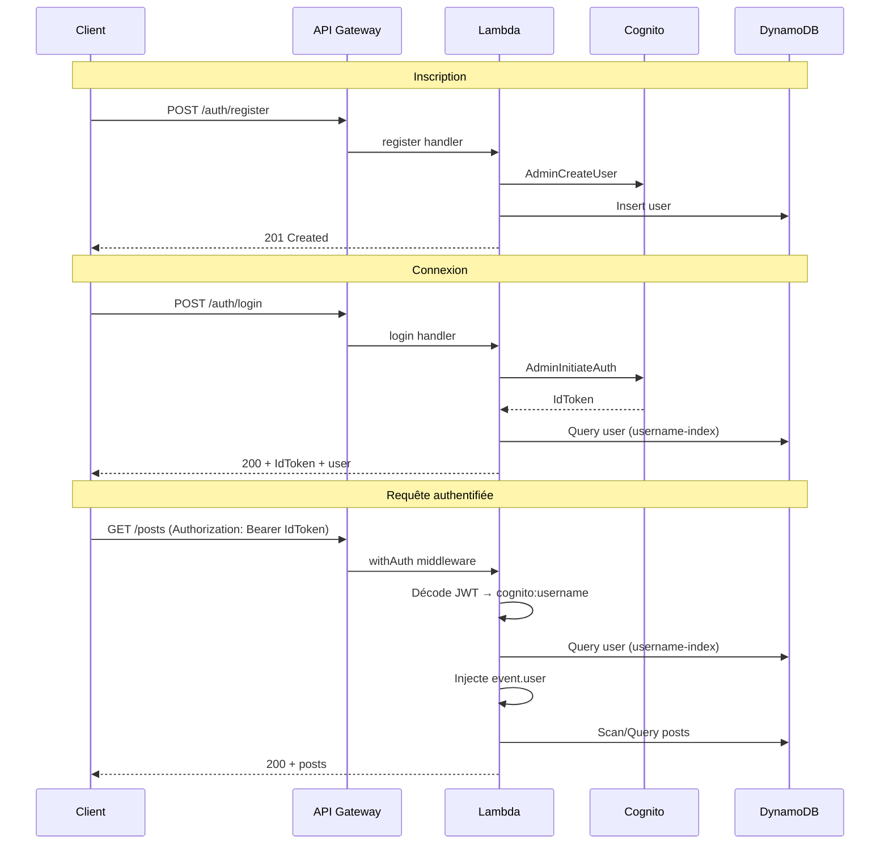

# Architecture — Micro Blogging App

## Vue d'ensemble

Application de micro-blogging (type Twitter/X) composée de trois couches : un SPA React, un backend serverless AWS Lambda, et une infrastructure définie en code via AWS CDK.



## Frontend

### Stack technique
- React 18, TypeScript (strict), Vite 4
- react-router-dom v6 (client-side routing)
- Context API pour la gestion d'état (pas de Redux/Zustand)
- Système i18n maison (EN/FR) sans librairie externe
- Playwright pour les tests E2E

### Architecture

```
frontend/src/
├── main.tsx              # Point d'entrée (React.StrictMode + ErrorBoundary)
├── App.tsx               # Routes, Layout, ProtectedRoute
├── contexts/             # Providers React Context
│   ├── AuthContext.tsx    # Authentification (login, register, logout, token)
│   └── LanguageContext.tsx # Langue active (EN/FR), persistée en localStorage
├── pages/                # Composants de page (1 page = 1 route)
├── components/           # Composants réutilisables
├── services/api.ts       # Couche HTTP (fetch), groupée par domaine
├── types/                # Interfaces TypeScript (User, Post)
└── i18n/translations.ts  # Dictionnaire de traductions clé → {en, fr}
```

### Routing

| Route              | Page        | Protégée |
|-------------------|-------------|----------|
| `/login`          | Login       | Non      |
| `/register`       | Register    | Non      |
| `/`               | Feed        | Oui      |
| `/create`         | CreatePost  | Oui      |
| `/profile/:userId`| Profile     | Oui      |

Les routes protégées redirigent vers `/login` si l'utilisateur n'est pas authentifié.

### Gestion d'état
- Le token JWT et les infos utilisateur sont stockés dans `localStorage`
- `AuthContext` expose : `isAuthenticated`, `user`, `token`, `login()`, `register()`, `logout()`
- `LanguageContext` expose : `language`, `toggleLanguage()`, `t()` (fonction de traduction)

### Couche API (`services/api.ts`)
Client HTTP basé sur `fetch`, organisé en trois objets :
- `authApi` — `register()`, `login()`
- `usersApi` — `getProfile()`, `updateProfile()`, `followUser()`, `unfollowUser()`, `checkFollowing()`
- `postsApi` — `getPosts()`, `getPost()`, `createPost()`, `updatePost()`, `deletePost()`, `likePost()`, `unlikePost()`

L'URL de l'API est configurée via la variable d'environnement `VITE_API_URL`.

## Backend

### Stack technique
- AWS Lambda, Node.js 22, JavaScript (CommonJS)
- AWS SDK v3 (DynamoDB, Cognito)
- `uuid` pour la génération d'identifiants

### Architecture
Chaque endpoint API correspond à une fonction Lambda distincte. Les handlers sont organisés par domaine :

```
backend/src/
├── common/
│   └── middleware.js       # withAuth() — validation JWT + résolution utilisateur
└── functions/
    ├── auth/
    │   ├── login.js        # POST /auth/login
    │   └── register.js     # POST /auth/register
    ├── posts/
    │   ├── createPost.js   # POST /posts
    │   ├── getPosts.js     # GET /posts, GET /users/{userId}/posts
    │   └── likePost.js     # POST /posts/{postId}/like
    ├── users/
    │   ├── getProfile.js   # GET /users/{userId}
    │   ├── updateProfile.js# PUT /users/{userId}
    │   ├── followUser.js   # POST /users/{userId}/follow
    │   ├── unfollowUser.js # POST /users/{userId}/unfollow
    │   └── checkFollowing.js # GET /users/{userId}/following
    └── monitoring/
        └── emitCustomMetrics.js  # Métriques CloudWatch (invocation interne)
```

### Middleware d'authentification
Le wrapper `withAuth(handler)` :
1. Extrait le token JWT du header `Authorization: Bearer <token>`
2. Décode le payload JWT pour extraire le `cognito:username`
3. Résout l'utilisateur dans DynamoDB via le GSI `username-index`
4. Injecte `event.user = { id, username }` avant d'appeler le handler
5. Fallback : validation via Cognito `GetUserCommand` si le décodage échoue

Les endpoints `/auth/login` et `/auth/register` n'utilisent pas ce middleware.

### Conventions des réponses
Toutes les réponses Lambda suivent le même format :
```json
{
  "statusCode": 200,
  "headers": {
    "Content-Type": "application/json",
    "Access-Control-Allow-Origin": "*",
    "Access-Control-Allow-Credentials": true
  },
  "body": "{ ... }"
}
```

## Infrastructure (AWS CDK)

### Stack : `MicroBloggingAppStack`
Définie dans `infrastructure/lib/app-stack.ts`, déployée via CDK v2.

### Ressources

#### Authentification
- **Cognito User Pool** — inscription self-service, vérification email, politique de mot de passe (8+ chars, majuscule, minuscule, chiffre)
- **User Pool Client** — flows `USER_PASSWORD_AUTH`, `USER_SRP_AUTH`, `ADMIN_USER_PASSWORD_AUTH`
- **Identity Pool** — identités fédérées (rôle authentifié uniquement)

#### Base de données (DynamoDB, PAY_PER_REQUEST)

| Table    | Partition Key | Sort Key    | GSIs                                          |
|----------|--------------|-------------|-----------------------------------------------|
| Users    | `id` (S)     | —           | `username-index` (PK: username)               |
| Posts    | `id` (S)     | —           | `userId-index` (PK: userId, SK: createdAt)    |
| Likes    | `userId` (S) | `postId` (S)| `postId-index` (PK: postId)                   |
| Comments | `id` (S)     | —           | `postId-index` (PK: postId, SK: createdAt)    |
| Follows  | `followerId` (S) | `followeeId` (S) | `followee-index` (PK: followeeId, SK: followerId) |

#### API
- **API Gateway REST** avec CORS activé (tous les origines/méthodes)
- Chaque route intégrée directement à une Lambda via `LambdaIntegration`

#### Hébergement frontend
- **S3 Bucket** — accès public bloqué, accessible uniquement via CloudFront OAI
- **CloudFront Distribution** — HTTPS, cache optimisé, SPA fallback (403/404 → `/index.html`)

### Bundling Lambda
Les fonctions sont bundlées via `NodejsFunction` (esbuild) avec `@aws-sdk/*` en modules externes (fournis par le runtime Lambda).

## Flux d'authentification



## Design System

Le design suit les conventions documentées dans `DESIGN_LANGUAGE.md` :
- Thème violet et blanc (#8b5cf6 accent principal)
- Polices système (Inter, system-ui)
- Boutons arrondis (border-radius: 9999px)
- Cards avec bordures subtiles sur fond gris clair (#f5f8fa)
- Responsive : mobile-first avec breakpoints à 769px et 1200px
